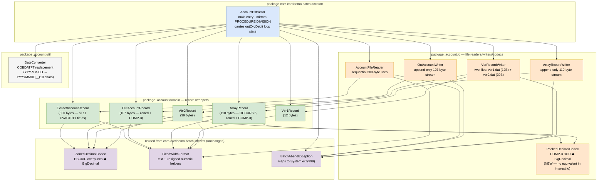

# CBACT01C Java Port — Class Architecture

Companion to [`CBACT01C-to-java-plan.md`](./CBACT01C-to-java-plan.md). This document captures the
planned class structure and dependency graph for the Java port at
[`app/java/batch_processing_workflow/`](../../app/java/batch_processing_workflow/).

## Dependency graph



## How to read it

Edges go **from the user to the dependency** — `A --> B` means "A imports or uses B". The graph
is acyclic and forms a clean layered hierarchy:

1. **`AccountExtractor`** (top) — the only orchestrator. Touches every other class. Mirrors the
   COBOL `PROCEDURE DIVISION` one-to-one, including the `outCycDebit` loop-state variable that
   replicates the sticky-debit carry-over behaviour (§5.3 of the plan).
2. **`.io` file-store classes** (`AccountFileReader`, `OutAccountWriter`, `ArrayRecordWriter`,
   `VbrRecordWriter`) — wrap byte-level I/O and ABEND on error.
3. **`.domain` record classes** — wrap their raw byte buffers and expose typed getters/builders
   via the codec helpers. Raw bytes preserve FILLER, ensuring re-encoding is byte-identical.
4. **Codec and utility leaves** (`PackedDecimalCodec`, `ZonedDecimalCodec`, `FixedWidthFormat`,
   `DateConverter`, `BatchAbendException`) — no outgoing internal dependencies. These are the
   foundation everything else builds on.

## Contrast with the CBACT04C port

| Aspect | CBACT04C (`interest` package) | CBACT01C (`account` package) |
| ------ | ----------------------------- | ----------------------------- |
| Codec | `ZonedDecimalCodec` only | `ZonedDecimalCodec` **+** new `PackedDecimalCodec` (COMP-3) |
| Output files | 2 (TRANSACT + ACCTFILE rewrite) | 4 (OUTFILE + ARRYFILE + VBR1 + VBR2) |
| Timestamp injection | Required (DB2 timestamp) | Not needed (no `CURRENT-DATE`) |
| External call | None | `COBDATFT` assembler → `DateConverter` |
| Loop state | `wsFirstTime` + `wsTotalInt` per account group | `outCycDebit` across all records |
| Inter-file lookup | Yes (XREF, DISCGRP, ACCOUNT random reads) | No (single sequential input) |
| GnuCOBOL changes | INDEXED → LINE SEQUENTIAL for 4 files | INDEXED → LINE SEQUENTIAL for 1 file; VBR → 2 fixed files; COBDATFT inlined |

## File-system map

```
app/java/batch_processing_workflow/src/main/java/com/carddemo/batch/account/
├── AccountExtractor.java
├── domain/
│   ├── ExtractAccountRecord.java
│   ├── OutAccountRecord.java
│   ├── ArrayRecord.java
│   ├── Vbr1Record.java
│   └── Vbr2Record.java
├── io/
│   ├── PackedDecimalCodec.java
│   ├── AccountFileReader.java
│   ├── OutAccountWriter.java
│   ├── ArrayRecordWriter.java
│   └── VbrRecordWriter.java
└── util/
    └── DateConverter.java
```

Reused from `com.carddemo.batch.interest` (no changes):

```
app/java/batch_processing_workflow/src/main/java/com/carddemo/batch/interest/
├── io/
│   ├── ZonedDecimalCodec.java      ← imported by EAR, OAR, ARR, V2R
│   └── FixedWidthFormat.java       ← imported by all domain + IO classes
└── util/
    └── BatchAbendException.java    ← imported by AE and all IO classes
```

## GnuCOBOL oracle layout

```
app/java/batch_processing_workflow/cobol-reference/
├── CBACT04P.cbl          (existing)
├── CBACT01P.cbl          (new — sequential-file portable oracle for CBACT01C)
└── tools/
    ├── build.sh          (extended to compile CBACT01P)
    ├── run.sh            (extended to run CBACT01P against fixtures/input/)
    └── regen-golden.sh   (extended to copy CBACT01P outputs → fixtures/expected/)
```

`CBACT01P.cbl` changes relative to `CBACT01C.cbl`:

| Change | Detail |
| ------ | ------ |
| `ACCTFILE-FILE` | `INDEXED SEQUENTIAL` → `LINE SEQUENTIAL INPUT` |
| `VBRC-FILE` | Replaced by two `RECORD SEQUENTIAL` files: `VBRC1-FILE` (12 B) and `VBRC2-FILE` (39 B) |
| `CALL 'COBDATFT'` | Replaced with inline COBOL: `STRING CODATECN-1O-YYYY CODATECN-1O-MM CODATECN-1O-DD DELIMITED SIZE INTO CODATECN-0UT-DATE` then space-fill remainder |
| All business logic paragraphs | Copied verbatim from `CBACT01C` |
