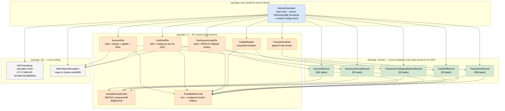

# CBACT04C Java Port — Class Architecture

Companion to [`CBACT04C-to-java-plan.md`](./CBACT04C-to-java-plan.md). This
document captures the actual class structure and dependency graph of the
Java port living at
[`app/java/batch_processing_workflow/`](../../app/java/batch_processing_workflow/).

## Dependency graph



## How to read it

Edges go **from the user to the dependency** — `A --> B` means "A imports
or uses B". The graph is acyclic and forms a clean 4-layer hierarchy:

1. **`InterestCalculator`** (top) — the only orchestrator. Touches every
   other class. Mirrors the COBOL `PROCEDURE DIVISION` 1:1 logically.
2. **`.io` file-store classes** (`AccountFile`, `CardXrefFile`,
   `DisclosureGroupFile`, `TcatBalReader`, `TransactionWriter`) — wrap
   collections of records, do the actual I/O, and ABEND on missing keys.
3. **`.domain` record classes** — wrap their raw byte buffers and expose
   typed getters/withers via the codec helpers. Raw bytes preserve FILLER
   and any unread fields, so re-encoding is byte-identical to decoding.
4. **`.io` codec helpers + `.util`** (the leaves: `ZonedDecimalCodec`,
   `FixedWidthFormat`, `Db2Timestamp`, `BatchAbendException`) — no
   outgoing internal dependencies. These are the foundation everything
   else builds on.

## Two design choices the diagram surfaces

- **`ZonedDecimalCodec` and `FixedWidthFormat` live in `.io` even though
  `.domain` records depend on them.** They're the byte-level I/O
  primitives, so the package boundary is honest — the domain records
  cannot be byte-accurate without these.
- **`Db2Timestamp` only has one caller (`InterestCalculator`).** It's a
  singleton-ish helper because both the COBOL oracle and the Java port
  need to inject the same fixed instant for byte-for-byte equivalence;
  the `Clock` indirection is the test seam.

## File-system map

```
app/java/batch_processing_workflow/src/main/java/com/carddemo/batch/interest/
├── InterestCalculator.java
├── domain/
│   ├── AccountRecord.java
│   ├── CardXrefRecord.java
│   ├── DisclosureGroupRecord.java
│   ├── TransactionCategoryBalanceRecord.java
│   └── TransactionRecord.java
├── io/
│   ├── ZonedDecimalCodec.java
│   ├── FixedWidthFormat.java
│   ├── AccountFile.java
│   ├── CardXrefFile.java
│   ├── DisclosureGroupFile.java
│   ├── TcatBalReader.java
│   └── TransactionWriter.java
└── util/
    ├── Db2Timestamp.java
    └── BatchAbendException.java
```
